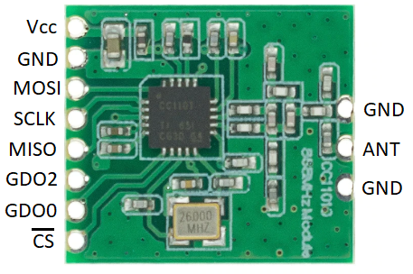
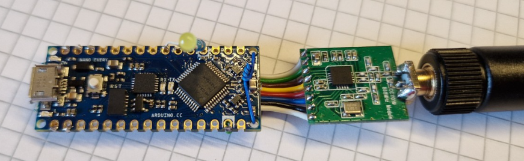
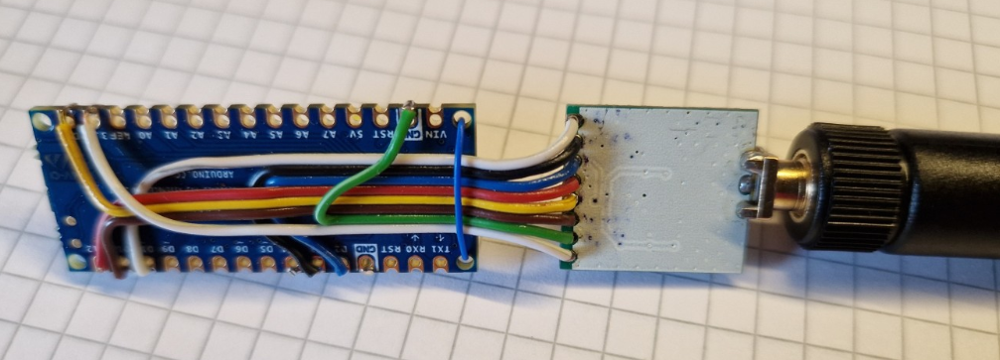

# EveryCUL
This is very rudimentary port of culfw to Arduino Nano Every that supports mbus reception only. I made this port as regular nanoCUL was unable to receive longer telegrams. It's stripped of almost everything not needed to listen to Wireless MBUS.

## DIY dongle
I made the dongle myself.
Required hardware:
 - Arduino Nano Every
 - [CC1101 module](https://aliexpress.com/item/1005004633785066.html) - make sure you're buying 868MHz version
 - Wire to connect everything together

Optional hardware:
 - [SMA PCB connector](https://aliexpress.com/item/1005001887840746.html) (type2 from linked listing)
 - [868MHz antenna](aliexpress.com/item/1005003723838944.html)
 - LED with resistor 330-470 Ohms, you need to choose proper resistor for the LED you're using

#### Soldering dongle
Connect pins as follows:

|Module|Arduino|
|--|--|
|Vcc|3,3V|
|GND|GND|
|MOSI|D11|
|SCLK|D13|
|MISO|D12|
|GDO2|D2|
|GDO0|D3|
|CS|D10|

After that solder either wire antenna you got with the module or the optional SMA connector.
To solder SMA connector directly, you'll need to shorten connector pins to about half original length. Check the length before cutting!

**Not recommended:** LED was needed for development of this port, otherwise it's useless. To install optional LED solder it in series with resistor first and then solder anode to D4 pin of Arduino. Check polarity of the LED :)

Final dongle should look like this:

## Convert dongle
Firmware port is pin compatible with nanoCUL stick so you need to replace Arduino Nano with Nano Every, flash firmware and it's done :)

## Flashing firmware

### Requirements
Arduino IDE installed, python3 with pyserial module ([required to reset Arduino](https://forum.arduino.cc/t/reset-nano-every-via-1200-baud-touch/939949)), PATH with added `<path to arduino>/hardware/tools/avr/bin`

### Flashing
Download released files. There should be nanoCUL.hex and nanoCUL.fuse.bin.
See the commands in flash.sh and adjust them to your needs or on linux run the script like `./flash.sh -d /dev/ttyACM0`.

